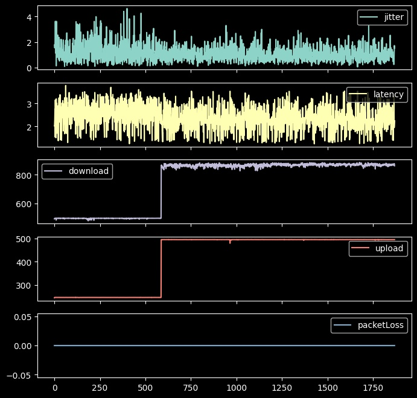

# isp-monitor

An example on how to monitor your ISP's stats with speedtest and pytyon.

I have setup a mini computer (could be a raspberry I guess), linked directly to my ISP's router on a 1Gbps port.

download [speedtest client](https://www.speedtest.net/apps/cli) for your platform.

Setup a job to run a speedtest generating a json output.

The command looks like this:

```bash
speedtest --server-id=18136 --format=json --unit=Mibps --progress=no
```

Generate the graphs with pandas and matplotlib, you'll find the code in `df_stas.py`.


